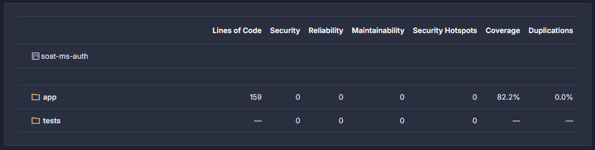

# SOAT Auth Microservice (soat-ms-auth)

Microsserviço responsável pela autenticação de usuários baseada em CPF. Este serviço valida o CPF, interage com o DynamoDB para persistência e gera tokens JWT para acesso a recursos protegidos.

## 📋 Sobre o Projeto

Este projeto foi desenvolvido utilizando **Python 3.13** e **FastAPI**, seguindo os princípios da **Clean Architecture (Arquitetura Hexagonal)** para garantir desacoplamento entre as regras de negócio e os detalhes de infraestrutura.

### Funcionalidades
- **Geração de Token:** Recebe um CPF, valida e retorna um token JWT.
- **Validação de CPF:** Garante que apenas CPFs válidos (formato e dígitos verificadores) sejam processados.
- **Cache/Persistência:** Verifica se já existe um token válido no DynamoDB antes de gerar um novo, otimizando o consumo de recursos.
- **Health Check:** Endpoint para verificação de saúde da aplicação (`/health`).

## 🚀 Tecnologias Utilizadas

- **Linguagem:** Python 3.13
- **Framework Web:** FastAPI
- **Servidor:** Uvicorn
- **Banco de Dados:** AWS DynamoDB
- **Autenticação:** PyJWT
- **Testes:** Pytest, Pytest-BDD (Behavior Driven Development)
- **Qualidade de Código:** Black, Flake8, SonarQube
- **Infraestrutura:** Docker, Kubernetes (EKS), AWS, GitHub Actions

## 🛡️ Políticas de Branch e Segurança

Para garantir a qualidade e a estabilidade do ambiente produtivo, foram configuradas regras rígidas de proteção no repositório (**Branch Protection Rules**):

1. **Bloqueio de Commits na Main:** - Não é permitido realizar commits diretamente na branch `main`. Toda alteração deve vir de uma branch auxiliar.

2. **Obrigatoriedade de Pull Requests (PR):**
   - Merges para a `main` só podem ser realizados através de Pull Requests devidamente abertos e revisados.

3. **Verificação de Status (CI):**
   - O merge do PR só é habilitado se a esteira de Integração Contínua (CI) for executada com sucesso. Isso inclui:
     - Execução e aprovação de todos os testes unitários e BDD.
     - Validação de qualidade e cobertura de código pelo SonarQube (Quality Gate).

## ⚙️ Configuração Local

### Pré-requisitos
- Python 3.13+
- Pipenv (`pip install pipenv`)
- Docker (opcional, para build da imagem)

### Variáveis de Ambiente
Crie um arquivo `.env` na raiz do projeto com as seguintes variáveis (baseado em `app/settings.py`):

```env
APP_NAME=Auth API
SECRET_KEY=sua_chave_secreta_aqui
ALGORITHM=HS256
TOKEN_ISSUER=auth_service
ACCESS_TOKEN_EXP_MINUTES=10
AWS_REGION=us-east-1
DYNAMODB_TABLE=auth_tokens
# Credenciais AWS locais (se necessário para interagir com o DynamoDB real):
AWS_ACCESS_KEY_ID=xxx
AWS_SECRET_ACCESS_KEY=xxx
AWS_SESSION_TOKEN=xxx
```

### Instalação e Execução

O projeto utiliza um `Makefile` para facilitar os comandos do dia a dia:

1. **Instalar dependências (Ambiente de Desenvolvimento):**
   ```bash
   make install-dev
   ```

2. **Rodar a aplicação:**
   ```bash
   make run
   ```
   A API estará disponível em `http://localhost:8085`.
   
   - **Documentação Swagger:** `http://localhost:8085/docs`
   - **Redoc:** `http://localhost:8085/redoc`

3. **Formatar e Verificar Lint:**
   ```bash
   make format
   make lint
   ```

4. **Limpar arquivos temporários:**
   ```bash
   make clean
   ```

## 🧪 Testes

O projeto inclui uma suíte robusta de testes unitários e de comportamento (BDD).

- **Executar todos os testes:**
   ```bash
   make test
   ```

- **Gerar relatório de cobertura no terminal:**
   ```bash
   make coverage
   ```

## 📊 Cobertura de Testes

Utilizamos o **SonarQube** para monitorar a qualidade do código e garantir que a cobertura de testes se mantenha elevada. O pipeline de CI/CD está configurado para exigir um mínimo de **80% de cobertura**.

Abaixo está o status atual da cobertura do projeto:



## 📦 CI/CD e Deploy

O deploy é automatizado via **GitHub Actions** (`.github/workflows/ci_cd.yml`) com as seguintes etapas:

1. **Build & Push:** - Constrói a imagem Docker.
   - Realiza o push para o GitHub Container Registry (GHCR).
   
2. **Tests & Sonar:** - Executa a suíte de testes (`pytest`).
   - Gera relatório de cobertura XML.
   - Envia análise para o SonarCloud.
   
3. **Deploy K8s:** - **Condição:** Executado apenas na branch `main`.
   - Aplica os manifestos Kubernetes no cluster EKS.
   - Atualiza a imagem do deployment `auth-service-backend`.

### Recursos Kubernetes
Os manifestos de infraestrutura estão localizados na pasta `infra/`:
- **Deployment:** Gerencia os Pods da aplicação com limites de recursos definidos.
- **Service:** LoadBalancer para expor a API internamente ou externamente.
- **HPA:** Horizontal Pod Autoscaler configurado para escalar baseado na utilização de CPU (target 75%).
- **Secrets:** Gerenciamento seguro de credenciais via Kubernetes Secrets.

---
**SOAT - Grupo 75**